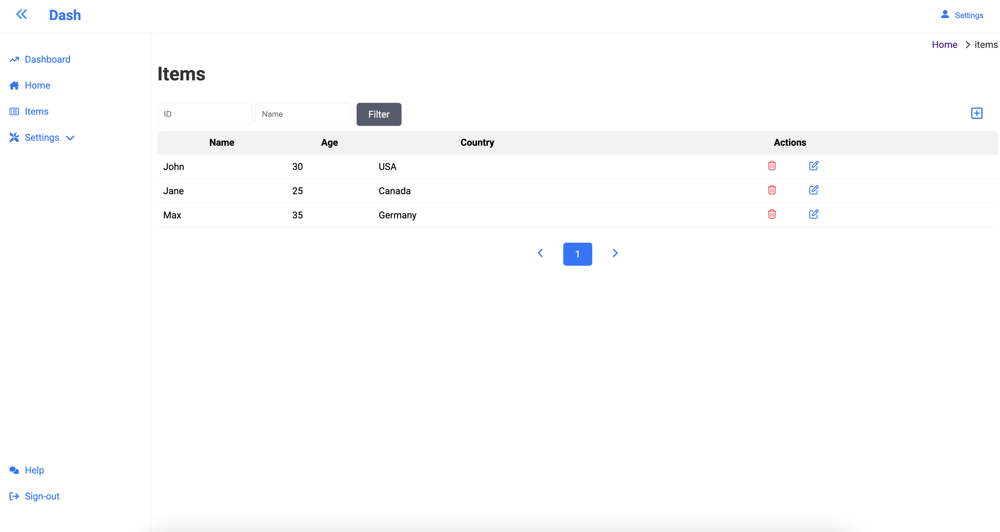
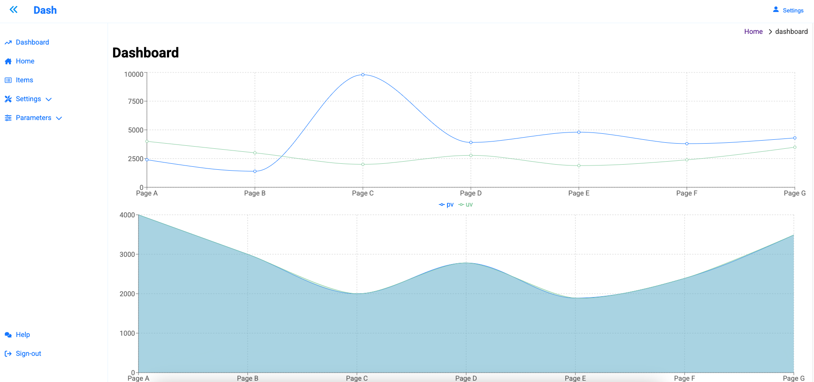
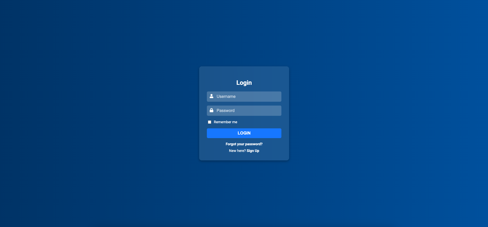
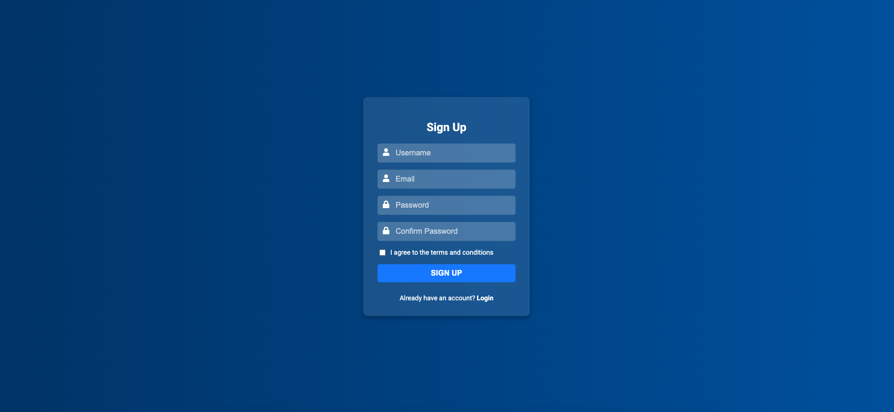

# System Dashboard

## Home


---
## Sign-in

---
## Sign-up


## Start here

To install this project you can use Docker or install the dependencies and run the default way.

If you got Docker you can run:

```bash
docker run -v .:/app -p 3000:3000 -it node bash
```

<br>

## For Devs

To use this template, when you create a new page, you need import the follow component `Container.tsx`. Into the component you'll put your content, data, whatever you whant. This is the base template, for example:

```typescript
import { Container } from "../../components/Container";

export const Home = () => {
    return (
        <Container>
            <h1>Home</h1>
            <p>Lorem ipsum dolor sit amet consectetur adipisicing elit. Reprehenderit non dolore molestiae rem vel! Reprehenderit possimus quia sint eaque dolorem officiis qui itaque fuga architecto debitis quae et, aut doloribus?</p>
        </Container>
    );
};
```

<br>

## Library React Charts (Recharts)

You can find more things here [Recharts](https://recharts.org/en-US/guide)

<br>

## Use Modal

### Funcionamento do Modal
1.	Fechamento ao clicar fora: Adicionado o evento onClick no ModalOverlay para fechar o modal ao clicar fora.
2.	Cabeçalho com título e botão de fechar: O botão &times; no cabeçalho fecha o modal.
3.	Responsividade: O modal se adapta ao tamanho da tela (máximo de 500px de largura e largura responsiva para telas menores).

### Example

```typescript
import React, { useState } from "react";
import Modal from "./Modal";

const App = () => {
    const [isOpen, setIsOpen] = useState(false);

    return (
        <div>
            <button onClick={() => setIsOpen(true)}>Open Modal</button>
            {isOpen && (
                <Modal title="Example Modal" onClose={() => setIsOpen(false)}>
                    <p>This is the content of the modal.</p>
                </Modal>
            )}
        </div>
    );
};

export default App;
```